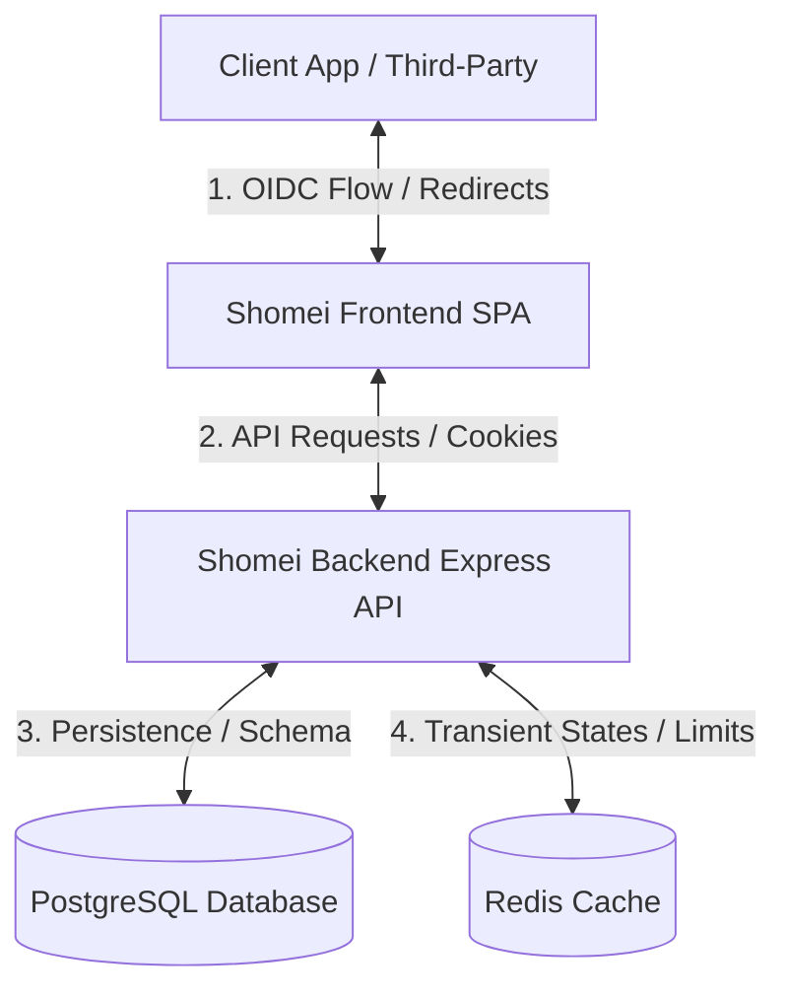
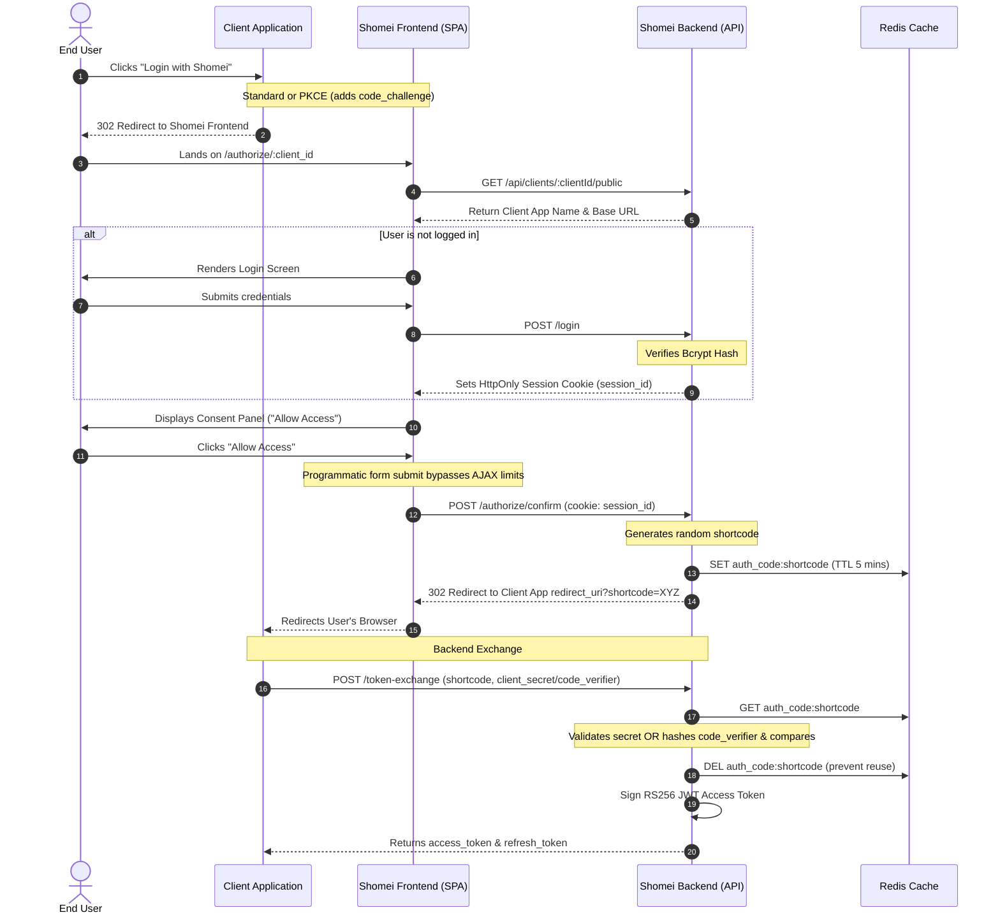

# 🌿 Shomei Auth

Shomei Auth is a fully-featured, self-hosted OpenID Connect (OIDC) identity provider built with Node.js, Express, React, PostgreSQL, and Redis. It acts as a centralized authentication server (similar to commercial solutions like Auth0, Clerk, or Keycloak) that allows developers to register client applications, manage user identities, and securely authorize third-party applications.

Shomei stands out by combining security engineering (such as Redis-backed shortcodes, rate-limiting, and PKCE) with a soothing, grounded nature aesthetic (glassmorphic panels, animated forest canopy, and a playful snake validator).

---

## 🏗️ Architecture and Data Flow

Shomei uses a microservice architecture containerized and orchestrated via Docker. 

### Core Components
1. **Shomei Frontend (`shomei_frontend`)**: A modern React Single Page Application (SPA) built with Vite and served using Nginx. It handles login, registration, developer app management, and OIDC consent prompts.
2. **Shomei Backend (`shomei_backend`)**: A Node.js Express 5 API that implements OIDC authorization, PKCE token exchange, OTP email dispatch, session management, and JWT generation.
3. **Database (`shomei_postgres`)**: The persistent store of truth using PostgreSQL, containing tables for `users`, OIDC `clients`, `refresh_tokens`, `user_sessions` (OAuth consents), and `otp_codes`. Managed via **Drizzle ORM**.
4. **Cache/Store (`shomei_redis`)**: An in-memory store used to maintain transient OIDC authorization codes (shortcodes) with TTL expirations and enforce rate limiters.

### System Topology & Relationships


### OIDC Authorization Code Flow (Standard vs PKCE)
Shomei supports both the standard server-side authorization flow and the Proof Key for Code Exchange (PKCE) flow.



---

## 🛠️ Technology Stack

### Monorepo Core
- **Package Manager**: npm Workspaces (monorepo routing)
- **Runtime Environment**: Node.js (ES Modules syntax)

### Frontend Service
- **Core Library**: React 18+ (Vite builder)
- **Styling**: Vanilla CSS with custom design tokens (Nature-themed palettes, wood bevels, moss glows)
- **Animations**: Framer Motion (canopy leaf/bird overlays, error alert shakes)
- **Icons**: Lucide React
- **HTTP Client**: Axios

### Backend Service
- **Framework**: Express 5.2 (HTTP Routing)
- **Database ORM**: Drizzle ORM (SQL compiler & query builder)
- **Database Client**: `node-postgres` (`pg` driver)
- **Cache Client**: `ioredis` (Redis connectivity)
- **Security & Tokens**:
  - `jsonwebtoken` (Asymmetric RS256 JWT signing/validation)
  - `bcrypt` (Salted credential hashing)
  - `express-rate-limit` & `rate-limit-redis` (Distributed rate limiting)
- **Communications**: `resend` SDK (Transactional SMTP/API email delivery)

### Infrastructure & Deployment
- **Containerization**: Docker & Docker Compose
- **Web Server / Reverse Proxy**: Nginx (serving frontend build assets in container)
- **Automation / CI-CD**: GitHub Actions deploying to a VPS via SSH triggers

---

## 🌟 Capabilities & Features

1. **Self-Hosted OpenID Connect (OIDC)**: Fully-functional Identity Provider (IdP) supporting the authorization code flow, `.well-known/openid-configuration` discovery, JWKS keys distribution, and token signing using asymmetric RSA-256 keys.
2. **PKCE Security for SPAs and Mobile Apps**: Implements SHA-256 verification of `code_verifier` against the authorization time's `code_challenge`, eliminating client secret requirements for public frontends.
3. **Developer Management Portal**: Registered developer accounts can create OAuth applications, manage client secrets, view their registration configurations, and monitor live active user connections.
4. **Granular Access Revocation**: End-users can log in to their main dashboard and view all external apps holding active permissions. Users can revoke client app access individually or invalidate all sessions globally.
5. **Secure Verification & Password Resets**: Integrates verification OTPs sent via email upon user registration, preventing invalid sign-ups. Forgot password flows utilize intent-specific OTP configurations.
6. **Resilient Rate Limiting**: Employs multiple Redis-backed limits protecting login, registration, and OTP generation channels against DDoS attacks, bot spam, and brute force enumeration.
7. **Bespoke Nature-Themed UI**: An immersive nature-inspired authentication screen using glassmorphism, glowing moss indicators, deep wood-beveled inputs, falling leaf overlays, and flying birds.

---

## 🧠 Architectural Insights and Learnings

During development, several key design decisions were made to address constraints, optimize performance, and harden security:

* **Redis-Backed Shortcodes vs. SQL Storage**: OIDC authorization codes are transient credentials with a strict 5-minute lifespan. Storing them in PostgreSQL causes frequent write/delete overhead and table indexing bloat. Storing them in Redis with a native TTL (`EX 300`) delegates cleanups to Redis's internal engine, ensuring the primary SQL database remains clean and performance scales linearly.
* **SPA Redirect Isolation via Programmatic Form Submissions**: React routing and Axios intercept standard redirect status codes (such as `302 Found`), which prevents the browser from naturally navigating to a third-party callback URI. To handle this, the React client compiles arguments and triggers a programmatic, hidden HTML form submission (`form.submit()`), giving the native browser agent control over redirect chains.
* **Centralized Database Syntax Masking**: Centralized Express error handlers often return raw database or ORM error statements to the client. This exposes critical backend data structures, Drizzle schemas, and table names. The error handler was custom-designed to analyze error classes, mask database errors as generic `500 Internal Server Errors`, and expose only safe, operational validation errors to clients.
* **OTP Entropy & PRNG Predictability**: The initial system utility for generating OTPs utilized JavaScript's `Math.random()`, which is a predictable Pseudo-Random Number Generator (PRNG). To fix this cryptographically unsafe practice, the system can be updated to utilize Node's `crypto.randomInt()`, ensuring high entropy values that cannot be guessed or predicted.
* **Post-Reset Global Session Invalidation**: In the event of password resets, attackers with active hijacked access tokens could remain logged in. To counter this, Shomei's database schema maps user sessions to client authorizations. Updating a password immediately triggers a global revoke (`status: 'revoked'`) for all sessions associated with that user ID, securing the account immediately.

---

## ⚙️ Feature & Implementation Deep-Dive

### 1. Two-Tier Rate Limiting
To prevent automated brute force attacks, limits are split into two categories using Redis:
- **Global API Limiter**: Applied globally across all requests. Restricts clients to 100 requests per 15-minute window.
- **Email/IP Identity Limiter**: Applied on auth endpoints (`/login`, `/user-signup`, `/verify-otp`, `/reset-password`). Restricts logins to 10 attempts per 15 minutes, and restricts email-triggering actions (like sending OTPs) to a maximum of 5 requests per hour. The rate limiter identifies users dynamically by resolving their email field from the HTTP request body:
  ```javascript
  keyGenerator: (req) => {
    const ipAddress = req.headers['x-forwarded-for'] || req.socket.remoteAddress || 'unknown';
    return req.body?.email || ipAddress;
  }
  ```

### 2. Secure OTP Account Verification
Upon signing up, a user is inserted with `is_verified: false`. An OTP is generated using a 6-digit numeric generator, saved in the database with an expiration date (5 minutes out), and emailed to the user via Resend:
```javascript
const [newUser] = await db.insert(users).values({ name, email, password_hash }).returning();
const otp = generateOTP();
await db.insert(otpCodes).values({
    user_id: newUser.id,
    otp_code: otp,
    expires_at: new Date(Date.now() + 5 * 60000),
});
await sendOTPMail(email, otp);
```
During verification, the database OTP is validated. If matches are found and it hasn't expired, the user's status is flipped to `is_verified: true` and the OTP code is deleted to prevent reuse.

### 3. PKCE Authorization Flow
When public applications request access, they pass a `code_challenge` and a `code_challenge_method` (defaults to `S256`).
- **Authorization Consent**: The challenge is saved with the client identity in a temporary Redis record:
  ```javascript
  const payload = { client_id, user_id, code_challenge, code_challenge_method };
  await redisClient.set(`auth_code:${shortcode}`, JSON.stringify(payload), 'EX', 300);
  ```
- **Token Exchange**: During the post request, the client application passes a plain-text `code_verifier`. The backend retrieves the challenge from Redis, hashes the verifier using SHA-256 base64url, and validates the match:
  ```javascript
  const hash = crypto.createHash('sha256').update(codeVerifier).digest('base64url');
  if (hash !== authCode.code_challenge) {
    throw new Error("Invalid code_verifier");
  }
  ```
  If validation succeeds, the Redis key is deleted immediately to prevent replay attempts.

---

## 📈 Accomplishments and Metrics

* **100% Database Debloating (OIDC Codes)**: Storing authorization codes (shortcodes) in Redis instead of PostgreSQL reduced database indexing operations and table growth. Temporary code writes are handled entirely in memory, lowering CPU overhead on the database to negligible levels.
* **Mitigated Account Harvesting Threats**: By enforcing email enumeration countermeasures in forgot-password pathways, automated scans of user bases yield zero usable information.
* **Immediate Threat Remediation on Reset**: Global session invalidation terminates 100% of active third-party application sessions instantly upon password reset, closing hijacking windows.
* **Secured Client Sessions**: Access tokens are configured with short 2-day lifespans using asymmetric `RS256` keys. Secure refresh tokens are backed by persistent storage to allow instant client revocation.
